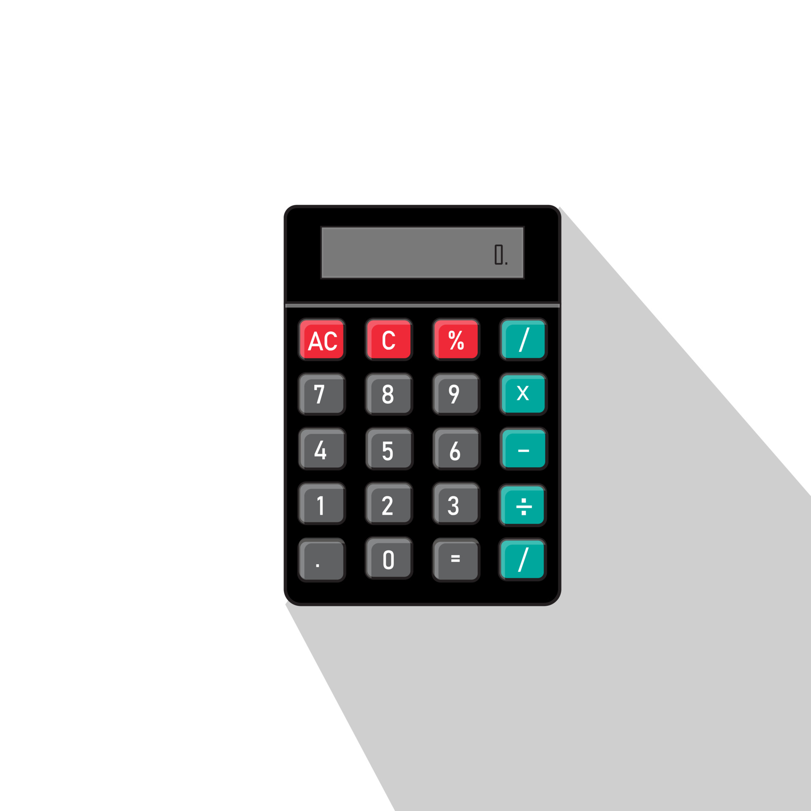

# Odin Calculator
## Design Inspiration

Source: Vecteezy.com

## Description
- **This is the final project in TOP's foundations course**
- **The goal is to build a full project with a UI and logic to enforce the acquired skills obtained during the course**

## Functionality
- **This calculator is designed to calculate 1 expression at a time, when an operation is selected, selecting another operation will not be allowed (as required by TOP)**
- **There are 2 ways to calculate an expression: either write the expression and click on the same chosen operator, or through the assignment operator (e.g. 2 + 2, clicking + again will result in 4)**
- **There is keyboard support allowing to type numbers from 0 to 9, but other characters are not allowed.**
- **Invalid operations will cause an 'ERROR' message**

## Special Note
### No AI was used to generate any of the code in this project. All logic was produced by me.
